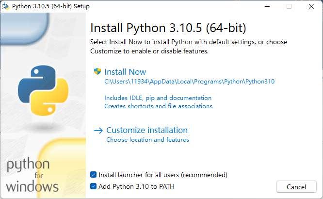
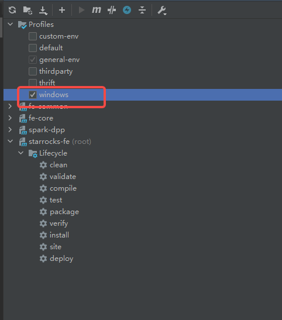
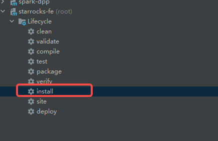
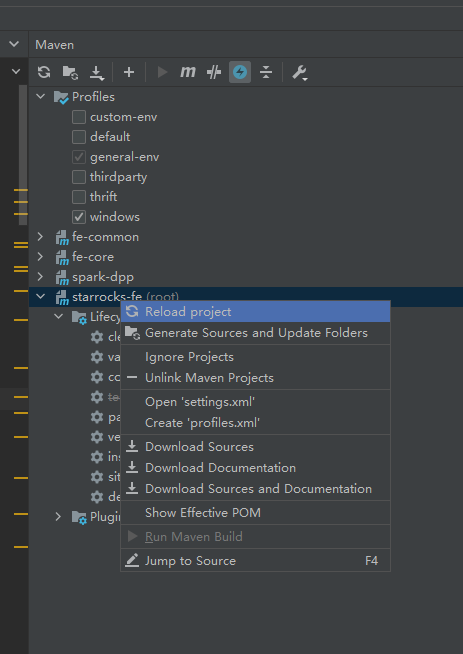
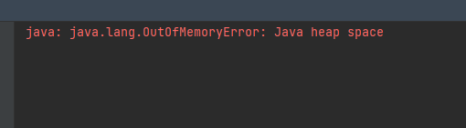
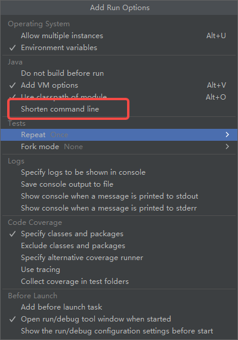

# Set StarRocks FE Development Environment in Windows

This topic describes how to set development environment for StarRocks FE in Windows OS.

## Prerequisite

To build the development environment of StarRocks FE in Windows OS, you must have [IDEA](https://www.jetbrains.com/idea/download) installed on your device.

## Download dependencies

1. Download [Apache Thrift](https://www.apache.org/dyn/closer.cgi?path=/thrift/0.13.0/thrift-0.13.0.exe) (0.13.0 or higher), rename the file as **thrift.exe** and store it under the directory **windows**.
2. Download [JDK 1.8.0](https://www.oracle.com/java/technologies/downloads/), and specify the environment variable `JAVA_HOME` as the directory of JDK.
  
3. Install [Python 3](https://www.python.org/downloads/) (3.10.5 or higher). Make sure to tick **Add Python to PATH** while installing Python.
  

## Configure IDEA

1. Launch IDEA. (Restart it if it is running.)
2. Tick **windows** under **Profiles**.
  
3. Run **install** under **starrocks-fe/Lifecycle**.
  
4. Reload the project after the installation.
  

## FAQ

**Q: What should I do if OOM occurs when I run IDEA?**

A: Increase the value of **Shared Build heap size (Mbytes)** to `1500` under **Setting** --> **Build, Execution, Deployment** --> **Compiler**.

**Q: Error: "Command line is too long". What should I do?**

A: Tick **Shorten command line** under **Add Run Options** --> **Java**.

